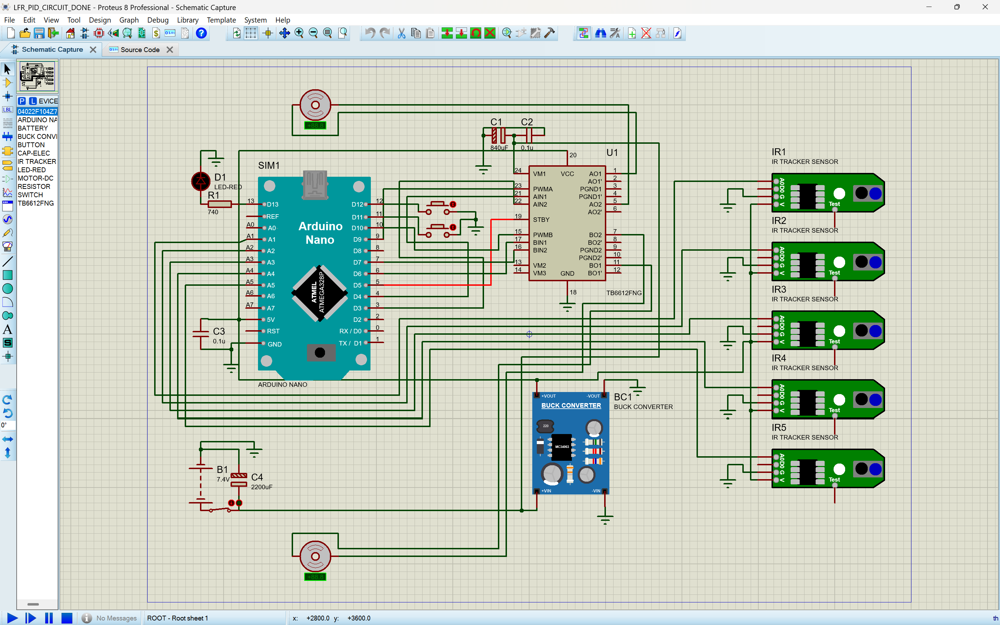
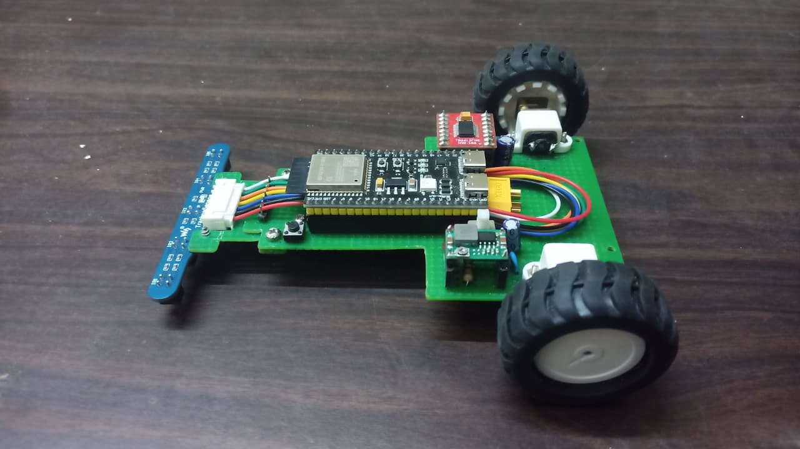

<div align="center">

# LFR-PID-ESP32

### Line Follower Robot with PID Control, Obstacle Avoidance & Real-Time Web Dashboard

[](https://www.arduino.cc/)
[](https://www.espressif.com/)
[](https://www.labcenter.com/)
[](LICENSE)

<br/>

> A fully custom-built autonomous Line Follower Robot using a **5-channel IR sensor array** and a **PID control loop**, with real-time telemetry streamed over Wi-Fi to a browser-based debug dashboard. Prototyped in **Proteus 8 with Arduino Nano**, then deployed on a custom PCB with an **ESP32-S3**.

<br/>


</div>

---

## Table of Contents

- [Overview](#-overview)
- [Features](#-features)
- [Hardware](#-hardware)
  - [Components List](#components-list)
  - [Circuit Schematic](#circuit-schematic)
- [PID Control Algorithm](#-pid-control-algorithm)
- [Simulation (Proteus + Arduino Nano)](#-simulation-proteus--arduino-nano)
- [Final Build (ESP32-S3)](#-final-build-esp32-s3)
- [Web Debug Dashboard](#-web-debug-dashboard)
- [State Machine](#-state-machine)
- [Getting Started](#-getting-started)
- [File Structure](#-file-structure)
- [Results & Performance](#-results--performance)
- [Future Work](#-future-work)

---

## Overview

This project implements an autonomous **Line Follower Robot (LFR)** capable of:

- Tracking black lines on a white surface using a **5-channel IR sensor array**
- Applying a **PID (Proportional-Integral-Derivative)** controller for smooth, real-time motor corrections
- Detecting and avoiding obstacles with a **VL53L1X Time-of-Flight** sensor
- Serving a **live WebSocket debug dashboard** over Wi-Fi for remote monitoring and tuning

The development followed a two-stage pipeline: circuit design and validation in **Proteus 8 Professional** (targeting an Arduino Nano), followed by firmware deployment on a custom PCB driven by an **ESP32-S3**.

---

## Features

| Feature | Details |
|---|---|
| **PID Line Following** | Weighted error calculation across 5 IR sensors with tunable Kp, Ki, Kd |
| **Obstacle Avoidance** | VL53L1X ToF sensor with 160 mm threshold; full state-machine avoidance |
| **Wi-Fi Dashboard** | WebSocket server on ESP32 AP; live sensor, motor, and PID telemetry at ~20 Hz |
| **Proteus Simulation** | Full schematic with Arduino Nano validated before physical build |
| **Custom PCB** | ESP32-S3 + TB6612FNG motor driver on a single green-substrate board |
| **E-Stop & Calibration** | Remote commands over WebSocket: `CALIBRATE`, `START`, `STOP`, `RESET` |
| **Buck Converter Power** | MC34063-based step-down from 7.4 V LiPo to regulated logic supply |

---
---

## Hardware

### Components List

#### Microcontrollers

| Stage | MCU | Role |
|---|---|---|
| Simulation | Arduino Nano (ATmega328P) | Proteus 8 schematic validation |
| Final Build | ESP32-S3 | Wi-Fi, WebSocket server, full PID firmware |

#### Sensors & Actuators

| Component | Qty | Description |
|---|---|---|
| IR Tracker Sensor Module | 5 | Analog reflectance sensors (A0–A4), detect black/white surface |
| VL53L1X ToF Sensor | 1 | I2C Time-of-Flight distance sensor (up to 4 m, used at 160 mm threshold) |
| DC Gear Motor | 2 | Drive wheels, controlled via PWM through TB6612FNG |

#### Power & Driver

| Component | Value / Part | Description |
|---|---|---|
| LiPo Battery | 7.4 V, 2S | Main power source |
| Buck Converter | MC34063 | Steps 7.4 V down to regulated logic/motor voltage |
| Motor Driver | TB6612FNG | Dual H-bridge; PWMA/B, AIN1-2, BIN1-2 control lines |
| Filter Cap | C4 = 2200 µF | Main bulk decoupling |
| Filter Cap | C1 = 840 µF | Additional power filtering |
| Decoupling Cap | C2, C3 = 0.1 µF | High-frequency noise suppression |
| Current Limit Resistor | R1 = 740 Ω | Series resistor for indicator LED |
| Status LED | D1 (LED-RED) | Visual power/status indicator |

### Circuit Schematic

The circuit was designed in **Proteus 8 Professional**. Key connections:
<br>
<br/>


```
Arduino Nano / ESP32-S3
├── A0 → IR1 (analog output)
├── A1 → IR2
├── A2 → IR3
├── A3 → IR4
├── A4 → IR5
├── D9  → PWMA  ┐
├── D8  → AIN1  │  TB6612FNG
├── D7  → AIN2  │  Motor Driver
├── D10 → PWMB  │
├── D11 → BIN1  │
├── D12 → BIN2  ┘
├── SDA → VL53L1X SDA  (I2C)
└── SCL → VL53L1X SCL

TB6612FNG
├── AO1/AO1' → Left Motor
├── AO2/AO2' → (Brake/Direction)
├── BO1/BO1' → Right Motor
├── VM1-VM3  → Motor power rail (from Buck Converter)
└── STBY     → Pulled HIGH to enable driver

Power Rail
Battery (7.4V) → Buck Converter (MC34063) → VCC (logic) + VM (motors)
```

> **Schematic file:** `schematics_nano.PDF` and `LFR_PID_CIRCUIT_DONE_pdsprj_*.workspace` (open in Proteus 8)

---

## PID Control Algorithm

The robot uses a **weighted centroid error** across the 5-sensor array to calculate how far off-centre the line is, then feeds that error into a classical PID loop.


### Error Calculation

```
Sensor positions:  S0=-2  S1=-1  S2=0  S3=+1  S4=+2

          Σ (sensor_value[i] × position[i])
error  =  ─────────────────────────────────
                  Σ sensor_value[i]

Positive error → line is to the right → increase left motor, decrease right
Negative error → line is to the left  → decrease left motor, increase right
```

### PID Output

```
u(t) = Kp·e(t) + Ki·∫e(τ)dτ + Kd·de/dt

Left  motor speed = BASE_SPEED + u(t)
Right motor speed = BASE_SPEED − u(t)
```

### Tuned Parameters

| Parameter | Value | Effect |
|---|---|---|
| `Kp` | 0.32 | Proportional gain – primary steering correction |
| `Ki` | 0.001 | Integral gain – eliminates long-term drift |
| `Kd` | 1.0 | Derivative gain – damps oscillation |
| `BASE_SPEED` | 90 (PWM) | Forward cruise speed |
| `MAX_SPEED` | 150 (PWM) | Maximum corrected motor speed |


> The response plot illustrates how different gain values (K=0.5, K=1.1, K=1.6) affect settling behaviour. The selected gains minimise overshoot while achieving fast convergence to the reference.

---

## Simulation (Proteus + Arduino Nano)

The complete circuit was first validated in **Proteus 8 Professional** before any physical components were soldered.

**What was simulated:**
- 5 IR tracker sensors reading analog voltages
- TB6612FNG dual motor driver with PWM speed control
- Buck converter (MC34063) power regulation
- Arduino Nano running the PID firmware
- LED status indicator and decoupling network

**Simulation file:** `LFR_PID_CIRCUIT_DONE_pdsprj_LAPTOP-981M64LM_YASH.workspace`

> Open in **Proteus 8 Professional** → `File → Open Project` → select the `.workspace` file.

---

## Final Build (ESP32-S3)

The validated design was ported to a custom-fabricated PCB with an **ESP32-S3** as the main controller, adding Wi-Fi capability for the live dashboard.



**Upgrades over simulation:**
- ATmega328P replaced by **ESP32-S3** (dual-core 240 MHz, built-in Wi-Fi)
- WebSocket server hosted directly on the robot (AP mode, `192.168.4.1:81`)
- VL53L1X ToF sensor added for obstacle detection
- State machine expanded to 12 states (line follow + full obstacle avoidance + retrace)
- Custom green PCB with direct motor connector header and sensor ribbon cable

---

## Web Debug Dashboard

A single-file HTML dashboard (`lfr_dashboard.html`) connects to the ESP32's WebSocket server and provides real-time telemetry.


### Dashboard Panels

| Panel | What it shows |
|---|---|
| **IR Sensor Array** | Live bar graph for all 5 channels (0–1000 ADC range), colour-coded by activity |
| **ToF Distance** | Circular gauge + linear bar for VL53L1X reading; red alert below 160 mm threshold |
| **Bot State** | Current FSM state badge (colour changes with state: green = FOLLOW_LINE, blue = AVOID_*, red = ERROR_STOP) |
| **PID Values** | Live P, I, D component values with gain labels |
| **Motor Output** | Dual progress bars for left/right motor PWM (blue = forward, red = reverse) |
| **Controls** | Calibrate / Start / E-Stop / Reset — commands sent as JSON over WebSocket |
| **Event Log** | Timestamped log of state changes, obstacle events, and connection status |

### WebSocket JSON Protocol

**ESP32 → Browser (telemetry, ~20 Hz):**
```json
{
  "s":  [0, 55, 485, 874, 454],   // IR sensor values [S0..S4]
  "t":  371,                        // ToF distance in mm
  "st": 2,                          // State index (2 = FOLLOW_LINE)
  "ol": true,                       // On-line flag
  "err": 15,                        // PID error value
  "p":  15.0,                       // Proportional term
  "i":  0.000,                      // Integral term
  "dd": 0.0,                        // Derivative term
  "m1": 95,                         // Left motor PWM
  "m2": 85                          // Right motor PWM
}
```

**Browser → ESP32 (commands):**
```json
{ "cmd": "CALIBRATE" }
{ "cmd": "START" }
{ "cmd": "STOP" }
{ "cmd": "RESET" }
```

### Connecting to the Dashboard

1. Power on the robot
2. Connect your device to the ESP32's Wi-Fi access point (SSID defined in firmware)
3. Open `lfr_dashboard.html` in a browser
4. Set WebSocket URL to `ws://192.168.4.1:81` and click **Connect**
5. Use **Start demo** button to preview the dashboard offline with simulated data

---

## State Machine

The firmware implements a 12-state FSM for robust line-following and obstacle avoidance:

```
WAIT_CALIBRATE
      │  (CALIBRATE command received)
      ▼
WAIT_START
      │  (START command received)
      ▼
FOLLOW_LINE ◀──────────────────────────────────────┐
      │                                             │
      │  (ToF < 160 mm)                             │
      ▼                                             │
AVOID_LEFT_TURN                                     │
      │                                             │
      ▼                                             │
AVOID_LEFT_FORWARD                                  │
      │                                             │
      ▼                                             │
AVOID_RIGHT_TURN                                    │
      │                                             │
      ▼                                             │
AVOID_REJOIN_LINE ──────────────────────────────────┘
      │  (line not found)
      ▼
RETRACE_REJOIN_BACK
      │
      ▼
RETRACE_LEFT_TURN → RETRACE_SIDE_BACK → RETRACE_RIGHT_TURN → FOLLOW_LINE

ERROR_STOP  (sensor fault / unrecoverable loss)
```

---

## Getting Started

### Prerequisites

- [Arduino IDE](https://www.arduino.cc/en/software) ≥ 2.0 or [PlatformIO](https://platformio.org/)
- ESP32-S3 board package installed (`https://raw.githubusercontent.com/espressif/arduino-esp32/gh-pages/package_esp32_index.json`)
- Proteus 8 Professional (for simulation only)

### Libraries Required

```
Adafruit_VL53L1X    # ToF sensor driver
Wire                # I2C (built-in)
WebSocketsServer    # WebSocket server on ESP32
WiFi                # ESP32 Wi-Fi (built-in)
```

Install via Arduino Library Manager or `platformio.ini`:
```ini
lib_deps =
    adafruit/Adafruit VL53L1X
    links2004/WebSockets
```

### Flashing the ESP32-S3

```bash
# Clone the repository
git clone https://github.com/yash-saini-nx/LFR-PID-ESP32.git
cd LFR-PID-ESP32

# Open pid_main.ino in Arduino IDE
# Select board: ESP32S3 Dev Module
# Select port, then Upload
```

### Running the Simulation (Proteus)

1. Open Proteus 8 Professional
2. `File → Open Project` → select `LFR_PID_CIRCUIT_DONE_pdsprj_*.workspace`
3. Click **Run Simulation** (▶)
4. Observe IR sensor analog outputs and motor PWM signals on virtual oscilloscope

### Using the Dashboard

```bash
# No build step required — open directly in browser
open lfr_dashboard.html

# Or serve locally
python3 -m http.server 8080
# → visit http://localhost:8080/lfr_dashboard.html
```

---

## File Structure

```
LFR-PID-ESP32/
│
├── pid_main.ino                          # Main ESP32 firmware (PID + WebSocket + ToF)
├── lfr_dashboard.html                    # Web debug dashboard (single-file, no build)
│
├── schematics_nano.PDF                   # Exported Proteus schematic (Arduino Nano)
├── LFR_PID_CIRCUIT_DONE_*.workspace      # Proteus 8 project file
│
├── circuit_nano.png                      # Schematic screenshot
├── live_data.png                         # Dashboard screenshot
├── track_2_0.jpeg                        # Test track photograph
├── strct.jpeg                            # Robot build photograph
├── response_plot.png                     # PID step-response comparison plot
├── pid_block.webp                        # PID block diagram
│
└── README.md
```

---

## Results & Performance

| Metric | Value |
|---|---|
| Dashboard update rate | ~20 Hz |
| ToF obstacle threshold | 160 mm |
| Base forward speed | 90 PWM |
| Maximum corrected speed | 150 PWM |
| PID tuning (Kp / Ki / Kd) | 0.32 / 0.001 / 1.0 |
| Track complexity | Straight, curves, zigzag, diamond, intersections |

The robot was tested on a complex multi-section track (shown above) featuring: straight runs, tight S-curves, zigzag patterns, diamond intersections, and a dashed-line section. The PID controller maintained line tracking at base speed across all sections, with the obstacle avoidance state machine successfully recovering from simulated forward obstructions.

---

## Future Work

- [ ] Encoder feedback for closed-loop speed control
- [ ] OTA (Over-the-Air) firmware updates via Wi-Fi
- [ ] In-dashboard live PID gain tuning (send Kp/Ki/Kd over WebSocket)
- [ ] MPU-6050 IMU integration for turn angle measurement
- [ ] OLED display on-robot for standalone status
- [ ] Data logging to SD card for post-run PID analysis

---

## License

This project is open-source under the [MIT License](LICENSE).

---

<div align="center">

**Built by Yash Saini**  
*Embedded Systems · Robotics · PID Control*

[](https://github.com/yash-saini-nx)

</div>
